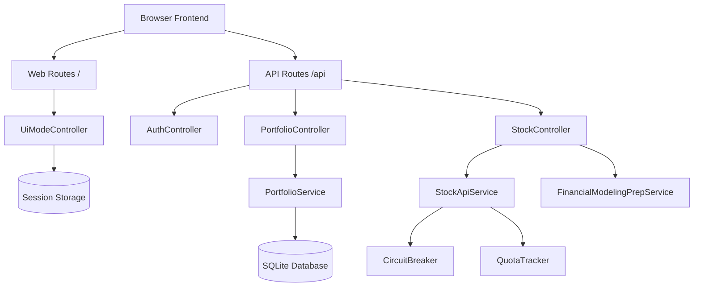

# Kid Investment Game - Codebase Documentation

This document provides a comprehensive overview of the application architecture, core systems, and development workflow.

## 1. Architecture Overview

The application is built on a modular Laravel 11 foundation with a decoupled service-oriented architecture.

### Technical Stack
- **Backend**: Laravel 11 (PHP 8.2+)
- **Database**: SQLite (Local development)
- **Frontend**: Blade Templates, Tailwind CSS (via CDN), Vanilla JS
- **Authentication**: Laravel Sanctum (API), Session-based (UI Mode)
- **External APIs**: AlphaVantage, Financial Modeling Prep (FMP)

### System Diagram


---

## 2. Core Components

### Service Layer (`app/Services`)
Business logic is isolated into dedicated service classes:
- **`StockApiService`**: Primary handler for AlphaVantage data. Includes retry logic and local caching.
- **`PortfolioService`**: Manages trading logic, balance validation, and portfolio valuation.
- **`CircuitBreaker`**: Protects the app from external API outages by pausing requests when failure thresholds are met.
- **`ApiQuotaTracker`**: Monitors usage of third-party API keys to prevent rate-limit bans.

### Controllers (`app/Http/Controllers/Api`)
Controllers are thin and act as entry points:
- **`PortfolioController`**: Handles buy/sell requests and summaries.
- **`StockController`**: Provides listed stock data and price history.
- **`AuthController`**: Managed registration, login, and token issuance (Sanctum).

### Security & Infrastructure
- **`SecurityHeaders` Middleware**: Enforces a strict Content Security Policy (CSP). It is configured to allow `https://cdn.tailwindcss.com` for local styling.
- **SQLite Database**: The application uses a local `database/database.sqlite` file for persistence.

---

## 3. Database Schema

- **`users`**: Extended with `balance`, `level`, and `experience_points`.
- **`stocks`**: Stores metadata about tradeable stocks (symbols, names, kid-friendly descriptions).
- **`portfolios`**: Tracks active user holdings.
- **`transactions`**: Immutable log of all buys and sells.
- **`achievements`**: Gamification milestones for the player.
- **`portfolio_audits`**: Historical snapshots of portfolio value for charting.

---

## 4. Getting Started

### Prerequisites
1. PHP 8.2+
2. Composer
3. API Keys (optional but recommended for real data):
   - AlphaVantage API Key
   - FMP API Key

### Installation
1. Clone the repository.
2. Run `composer install`.
3. Create the database: `touch database/database.sqlite`.
4. Run migrations: `php artisan migrate`.
5. Seed initial data: `php artisan db:seed`.

### Running Locally
```bash
php artisan serve
```
Access the app at `http://localhost:8000`.

---

## 5. Development Guidelines

### Adding New Features
1. **Migrations**: Create a migration for new tables.
2. **Models**: Define relationships clearly in the `App\Models` namespace.
3. **Services**: Place complex logic in a new Service class.
4. **Controllers**: Inject your New Service into a Controller.
5. **Routes**: Register the route in `routes/api.php` or `routes/web.php`.

### Troubleshooting Styling
If the frontend appears unstyled:
1. Ensure `https://cdn.tailwindcss.com` is accessible.
2. Check the `SecurityHeaders` middleware to verify CSP allows the CDN.
3. Perform a Hard Refresh (`Cmd+Shift+R`) to clear cached CSS.

---
*Last Updated: February 10, 2026*
